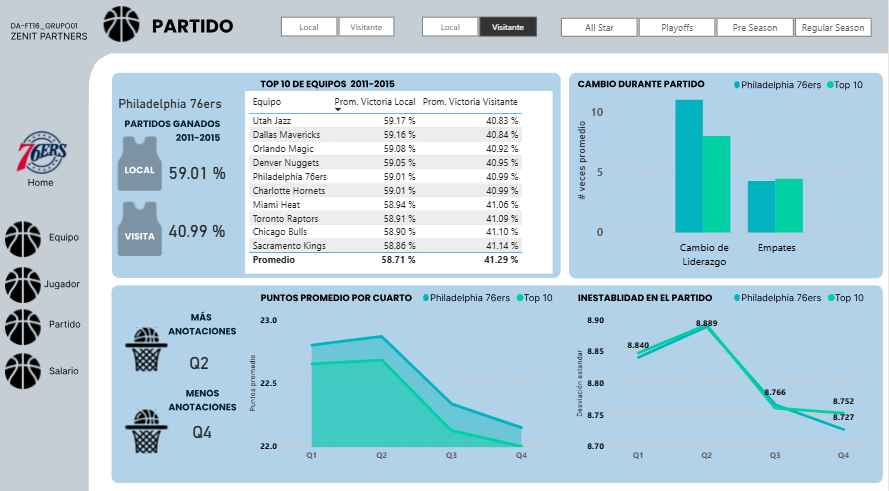

# 🚀 Proyecto de Análisis de Datos

<p align="center">
  
  
  
  
  
  
  
  
  
</p>

---

## 📖 Introducción
 **Resumen del proyecto**
 
Este proyecto se centra en el análisis del rendimiento del top 10 de equipos profesionales de la liga NBA para optimizar el desempeño deportivo y estratégico a partir de los insights obtenidos.
 
 **Metodología** 
 
Para abordar este desafío y alcanzar nuestros objetivos, se implementará una metodología que abarca todo el ciclo de vida del análisis de datos:
   - **Recolección y Preparación de Datos:** Recopilaremos varios Dataframes de la NBA para centrar nuestro analisis en 5 temporadas entre los años 2011 a 2015. 
   - **Análisis y Modelado:** Se explorarán los datos para identificar patrones y correlaciones de rendimiento de los equipos con más ranking vs nuestro equipo de interés.
   - **Visualización y Presentación:** Utilizaremos Power BI para transformar los hallazgos en un dashboard interactivo y accesible. 

**Resultados Esperados** 
   - Identificar los factores clave que más influyen en las victorias, proporcionando una hoja de ruta clara para la optimización estratégica del equipo.
   - Detectar tendencias de rendimiento por equipo y temporada, lo que permitirá a los analistas deportivos anticipar cambios en el juego y adaptar sus tácticas.
   - Generar visualizaciones interactivas que permitan a los tomadores de decisiones explorar datos, responder preguntas estratégicas.

---

## 🛠️ Tecnologías y Herramientas  

**Business Intelligence**  
        

**Bases de Datos**  
     

**Cloud & Data**  
    

**Lenguaje DAX**  
  

---

## 📸 Vista del Dashboard  

### 🔹 Dashboard Principal  
   

---

📂 También puedes explorar el proyecto completo descargando el archivo:  
[Descargar Analisis_Rendimiento_NBA.pbix](assets/Analisis_Rendimiento_NBA.pbix)

---

## 📚 Recursos del Proyecto
🔗 [Presentación en Genially](https://view.genially.com/68a64ddb5e26f77be892a57b/interactive-content-zenith)  
🔗 [Presentación introductoria al BI](https://view.genially.com/68b0bdff2bcfd40918350451/interactive-content-analisis-philadelphia-76ers) 

---

## 👥 Integrantes

- Camila Lopez      - DATA ENGINEER
- Jesús E. Mogan    - DATA ENGINEER
- Mayra Zolezzi     - DATA ANALYST
- Lucas Perez       - DATA ANALYST

---

## 📂 Organización del Repositorio

```bash
/main
   └── README.md
    /assets
       └── Analisis_Rendimiento_NBA.pbix
       └── dashboard_principal.png
/develop
   └── PF_NBA.ipynb
   └── csv_clean.file

/Mayra
   └── Presentación Genially
   └── Prueba lectura SQLite.ipynb
   └── Dashboard_partidos.pbix

/Camila      
  └── final_submission.file
  └── PF_NBA.ipynb

/Jesus
   └── Automatizacion.ipynb
   └── PF_NBA.ipynb

/Lucas
   └── Ciclo del dato.png
   └── Gantt (3).png
   └── PF_NBA.ipynb
 
